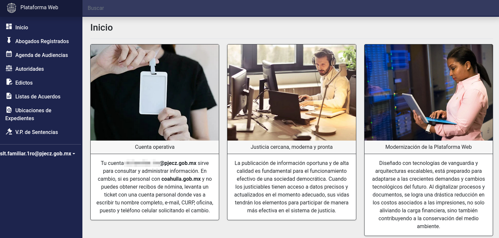
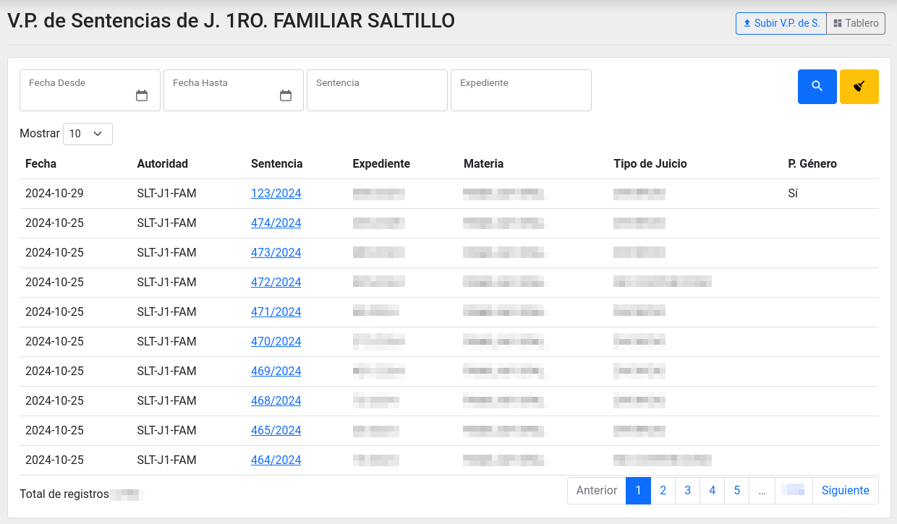
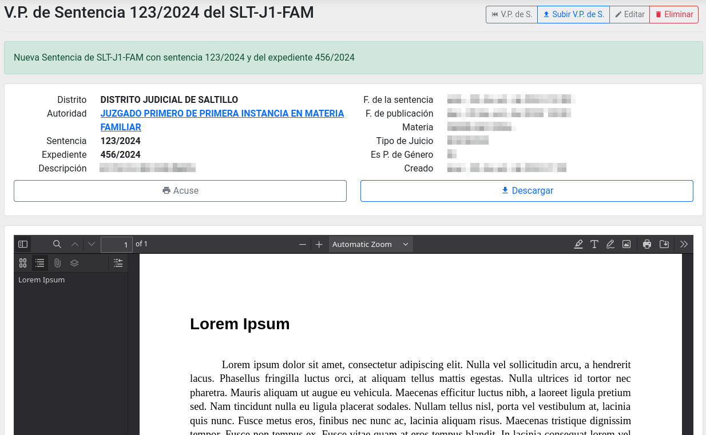
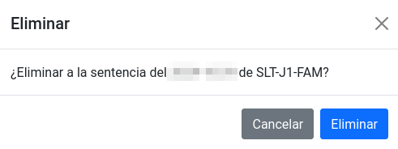
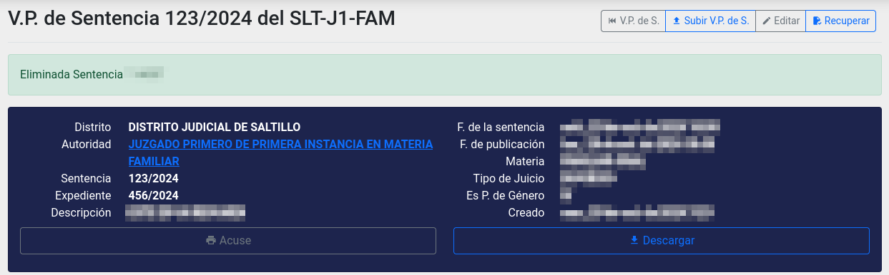
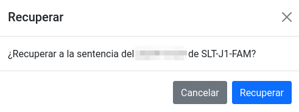

# Uso de V.P. de Sentencias para cuentas de Juzgados, Tribunales, Salas y Pleno

## Buscar y consultar

Ingrese a Plataforma Web con la cuenta del juzgado o tribunal, es decir,
con la cuenta pjecz.gob.mx propia de la autoridad, no personal.
La página de inicio se muestra así:

De clic en el módulo V.P. de Sentencias. Tendrá a a la vista el listado con las
V.P. Sentencias en orden cronológico inverso.

Use los botones **Anterior**, **No. de página** y **Siguiente** para cambiar la
página del listado. Si necesita ver más filas escoja en **Mostrar** otra cantidad.

O por medio del buscador, escriba en uno o más campos cómo lo quiere filtrar y
presione el botón **Lupa** o **ENTER** en su teclado. En cambio,
el botón **Escoba** limpia los campos del buscador y deja el listado sin filtros.

Localice lo que busca y de clic en su **Sentencia** para ir a su detalle.
En este ejemplo, en el primer bloque estarán los datos y en segundo la vista previa
del archivo PDF (requiere que el navegador de internet tenga esta capacidad).

Use el botón **Acuse** para generar el acuse mismo que puede imprimir,
a la impresora o para generar un archivo PDF.

Use el botón **Descargar** para bajar una copia del archivo PDF.

## Subir una V.P. de Sentencia

De clic en el botón **Subir V.P. de S.**. Se mostrará el formulario para subir.

Llene los campos mostrados. Los que aparecen en **negritas** son obligatorios:

- **Sentencia**
- **Expediente**
- **Fecha de la sentencia**
- **Fecha de publicación**
- Materia
- Tipo de Juicio: Después de elegir la materia debe indicar el tipo.
- Resumen: Opcionalmente puede escribir una síntesis de máximo mil caracteres.
- Es Perspectiva de Género: Marque la casilla de serlo.
- **Adjuntar el archivo:** Sólo archivos PDF.

Revise toda esta información antes de guardar, porque una vez guardada,
será pública de manera inmediata.

Al terminar de clic en el botón **Guardar**. Le mostrará el detalle.

## Editar

Hasta los siete días a partir de haber subido una V.P. de Sentencia, puede editarla.
Después de ese tiempo ya no podrán hacerse cambios.

Para editar [busque y entre al detalle](#buscar-consultar) de lo que quiera modificar.

De clic en el botón **Editar**. Mostrará el formulario de edición:

Haga los cambios necesarios y de clic en **Guardar**.
La consulta pública dará esta información de inmediato.

## Eliminar

Hasta los siete días a partir de haber subido una V.P. de Sentencia, puede eliminarla.
Después de ese tiempo ya no podrán hacerse cambios.

Para eliminar [busque y entre al detalle](#buscar-consultar) de lo que quiera modificar.

De clic en el botón **Eliminar**. Mostrará una pequeña ventana para confirmar:

Verifique que es lo que quiere eliminar.
De clic en **Eliminar** para que ya no sea público.
Al estar eliminado el detalle se muestra con fondo oscuro.

## Recuperar

Hasta los siete días a partir de haber subido una V.P. de Sentencia, puede recuperarla.
Después de ese tiempo ya no podrán hacerse cambios.

Para revertir lo que acaba de eliminar, de clic en el botón **Recuperar**.
Mostrará una pequeña ventana para confirmar:

Verifique que es lo que quire recuperar.
De clic en **Recuperar** para que este documento sea público de nuevo.
Al estar recuperado el detalle aparece con el fondo claro.
