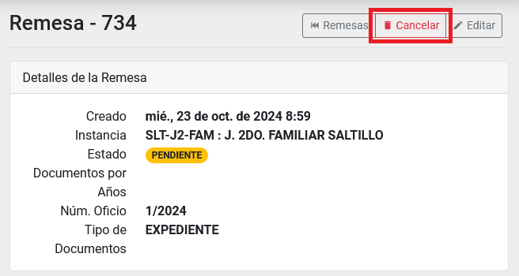
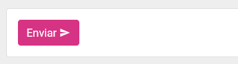

# Creación y envío de remesas por parte del _rol solicitante_

## Índice

  - [Búsqueda de remesa](#búsqueda-de-remesa)
  - [Ingresar al detalle de una remesa](#ingresar-al-detalle-de-una-remesa)
  - [Nueva remesa](#nueva-remesa)
  - [Cancelar remesa](#cancelar-remesa)
  - [Añadir documentos a una remesa](#añadir-documentos-a-una-remesa)
  - [Consultar, Editar o Quitar Documentos anexos a una remesa pendiente](#consultar-editar-quitar-documentos-anexos)
  - [Imprimir listado de documentos anexos](#imprimir-listado-de-documentos-anexos)
  - [Enviar remesa](#enviar-remesa)
  - [Pasar al historial una remesa](#pasar-al-historial-una-remesa)
  - [Consultar del historial](#consultar-el-historial)

---

## Búsqueda de remesa

Ingrese al módulo de __Archivo__ dentro del menú general del lado izquierdo con el nombre Archivo. El segundo listado será el de _Remesas_.

Puede utilizar los campos como filtros para reducir el número de registros en el listado y así encontrar un registro con más facilidad.

## Ingresar al detalle de una remesa

Ingrese al módulo de __Archivo__, dentro del menú general del lado izquierdo con el nombre Archivo. El segundo listado será el de _Remesas_.

Puede hacer una búsqueda para encontrar el registro indicado. [Búsqueda de solicitudes](#búsqueda-de-solicitudes).

De clic sobre el campo: _ID_ para ir al detalle de una solicitud.

.

Dentro del detalle podrá realizar más acciones, consultar la información de la solicitud y las bitácoras.

## Nueva remesa

Ingrese al módulo de __Archivo__ dentro del menú general del lado izquierdo con el nombre Archivo. El segundo listado será el de _Remesas_.

Localice al inicio de listado el botón __Nueva Remesa__.

Al presionar sobre el botón ira a una nueva pantalla.

Llene los campos y presione sobre el botón __Crear__.

En el _listado de Remesas_ aparecerá un nuevo registro con el estado de _Pendiente_.

## Cancelar remesa

Entre en el detalle de la remesa en cuestión que se encuentre en estado de _Pendiente_. [Ingresar al detalle de una remesa](#ingresar-al-detalle-de-una-remesa)

Presione el botón __Cancelar__.

Acepte el mensaje de advertencia.

## Añadir documentos a una remesa

Entre al __módulo de Expedientes__.

Localice el documento que debe estar en ubicación _Juzgado_.

Presione el botón __Añadir a Remesa__.

En la nueva ventana seleccione la remesa indicada.

Llene los campos restantes y presione sobre el botón __Agregar Documento__.

## Consultar, Editar o Quitar Documentos anexos a una remesa pendiente

Entre al detalle de una remesa que se encuentra en estado de _Pendiente_ y con un listado de documentos anexados. [Ingresar al detalle de una remesa](#ingresar-al-detalle-de-una-remesa)

Presione sobre los botones de acción que se encuentran en el listado de documentos en la columna derecha del registro.

## Imprimir listado de documentos anexos

Entre al detalle de una remesa que se encuentra en estado de _Pendiente_ y con un listado de documentos anexados. [Ingresar al detalle de una remesa](#ingresar-al-detalle-de-una-remesa)

Al final de _listado de documentos_ presione el botón __Imprimir Listado__.

Abrirá una nueva pantalla donde verá el listado de documentos anexos a la remesa.

Presione el botón __imprimir__ situado en la parte superior derecha de su pantalla.

## Enviar remesa

Entre al detalle de una remesa que se encuentra en estado de _Pendiente_ y con un listado de documentos anexados. [Ingresar al detalle de una remesa](#ingresar-al-detalle-de-una-remesa)

Se habilitará el botón __Enviar__. Presione dicho botón cuando se encuentre listo para enviar a Archivo esta remesa.

Acepte el mensaje de alerta.

En el listado de remesas ahora aparecerá con el estado de _Enviando_ y el departamento de archivo enviará a alguien a recogerla.

## Pasar al Historial una remesa

Ingrese al detalle de una _remesa_ con estado de _Archivado_. [Ingresar al detalle de una remesa](#ingresar-al-detalle-de-una-remesa)

Ahora vera habilitado el botón __Pasar al Historial__. De clic en él.

Esto hará que desaparezca de su listado de remesas, y pasará al listado de historial.

## Consultar el Historial

Ingrese al módulo de __Archivo__, dentro del menú general del lado izquierdo con el nombre Archivo.

En la parte superior del lado derecho aparecerá el botón __Historial__. Presione el botón y accederá al historial.

