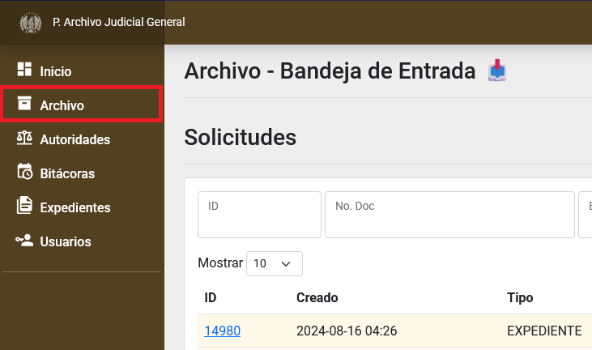
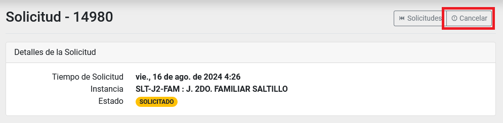
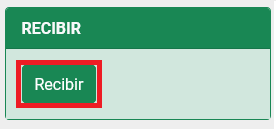
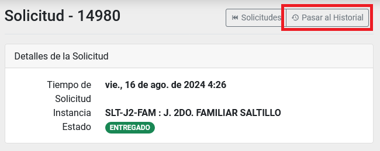

# Buscar, solicitar, cancelar, recibir y pasar al historial solicitudes de expedientes por parte del _rol solicitante_

## Índice

  - [Búsqueda de solicitudes](#búsqueda-de-solicitudes)
  - [Ingresar al detalle de una solicitud](#ingresar-al-detalle-de-una-solicitud)
  - [Nueva solicitud](#nueva-solicitud)
  - [Cancelar una solicitud](#cancelar-una-solicitud)
  - [Recibir una solicitud](#recibir-una-solicitud)
  - [Pasar al Historial una solicitud](#pasar-al-historial-una-solicitud)
  - [Consultar el Historial](#consultar-el-historial)

* * *

## Búsqueda de solicitudes

Ingrese al módulo de __Archivo__, dentro del menú general del lado izquierdo con el nombre Archivo. El primer listado será el de _Solicitudes_.

Puede utilizar los campos como filtros para reducir el número de registros en el listado y así encontrar un registro con más facilidad.

## Ingresar al detalle de una solicitud

Ingrese al módulo de __Archivo__, dentro del menú general del lado izquierdo con el nombre Archivo. El primer listado será el de _Solicitudes_.

Puede hacer una búsqueda para encontrar el registro indicado. [Búsqueda de solicitudes](#búsqueda-de-solicitudes).

De clic sobre el campo: _ID_ para ir al detalle de una solicitud.

Dentro del detalle podrá realizar más acciones, consultar la información de la solicitud y las bitácoras.

## Nueva solicitud

Ingrese al módulo de __Archivo__, dentro del menú general del lado izquierdo con el nombre Archivo. El primer listado será el de _Solicitudes_.

Presione sobre el botón __Nueva Solicitud__ que se encuentra sobre el listado de _solicitudes_ o ingrese directamente al módulo de __Expedientes__ y filtrando por el campo de _ubicación_ seleccione el valor de _archivo_. Al entrar al detalle de un expediente vera activo un botón llamado __Solicitar__.

Presionando sobre el botón __Solicitar__, se iniciará una solicitud de expediente. Puede indicar un _Número de Folio_ o una _Observación_ y presione sobre el botón __Solicitar__.

## Cancelar una solicitud

Ingrese al detalle de una _solicitud_. [Ingresar al detalle de una solicitud](#ingresar-al-detalle-de-una-solicitud)

Si la _solicitud_ se encentra en estado de _SOLICITADO_ aparecerá el botón __Cancelar__. Presione el botón __Cancelar__.

Acepte la ventana de advertencia.

Su solicitud ha sido cancelada.

## Recibir una solicitud

Ingrese al detalle de una _solicitud_ con estado de _Enviado_. [Ingresar al detalle de una solicitud](#ingresar-al-detalle-de-una-solicitud)

Dentro del detalle aparecerá el apartado de _Recibir_ con el botón __Recibir__.

Presione el botón __Recibir__ para cambiar el estado de la _solicitud_ a _Entregado_.

## Pasar al Historial una solicitud

Ingrese al detalle de una _solicitud_ con estado de _Entregado_. [Ingresar al detalle de una solicitud](#ingresar-al-detalle-de-una-solicitud)

Ahora vera habilitado el botón __Pasar al Historial__. De clic en él.

Esto hará que desaparezca de su listado de solicitudes, y pasará al listado de historial.

## Consultar el Historial

Ingrese al módulo de __Archivo__, dentro del menú general del lado izquierdo con el nombre Archivo. El primer listado será el de _Solicitudes_.

En la parte superior del lado derecho aparecerá el botón __Historial__. Presione el botón y accederá al historial.

