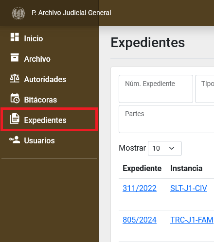

# Captura, búsqueda y edición de Expedientes pertenecientes al Archivo por parte de un usuario con cualquier rol

## Índice

  - [Captura de nuevo documento](#captura-de-nuevo-documento)
  - [Búsqueda de expediente](#búsqueda-de-expediente)
  - [Ingresar al detalle de un Expediente](#ingresar-al-detalle-de-un-expediente)
  - [Editar un expediente](#editar-un-expediente)

* * *

## Captura de nuevo documento

Ingresar al módulo de __Expedientes__ dando clic en la opción que se encuentra dentro del menú izquierdo general.

Presionar sobre el botón de __Nuevo Documento__ para comenzar la captura. Esto lo llevará a una nueva pantalla de captura.

Puede utilizar el recuadro del apartado: _búsqueda en Expediente Virtual_ para buscar por número de expediente y así recibir algunos campos ya llenados.

Escriba los campos correspondientes y presione sobre el botón __Crear__ para guardar el documento.

## Búsqueda de expediente

Ingresar al módulo de __Expedientes__ dando clic en la opción que se encuentra dentro del menú izquierdo general.

Utilice los campos de filtrado de columnas para buscar por diferentes campos el registro que desea.

## Ingresar al detalle de un Expediente

Ingresar al módulo de __Expedientes__ dando clic en la opción que se encuentra dentro del menú izquierdo general.

Presione sobre el campo: _Número de Expediente_ del registro. Ingresará al detalle del expediente.

Aquí puede editar y revisar la información del Expediente y sus bitácoras, sus solicitudes y remesas en las que ha participado.

## Editar un expediente

Ingresar al _módulo de _Expedientes__ dando clic en la opción que se encuentra dentro del menú izquierdo general.

Localice el expediente que desea haciendo uso de los filtros o consulte el apartado de [búsqueda de expediente](#búsqueda-de-expediente).

Presione sobre el campo: _Número de Expediente_ para ingresar al detalle del expediente.

Presione sobre el botón __Editar__.

Cambie los campos que desea y presione sobre el botón __Guardar__.
