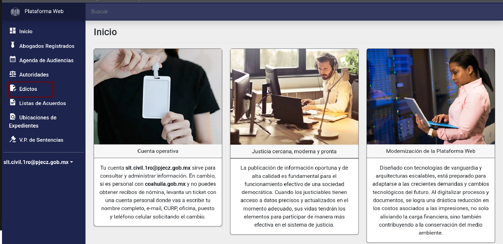
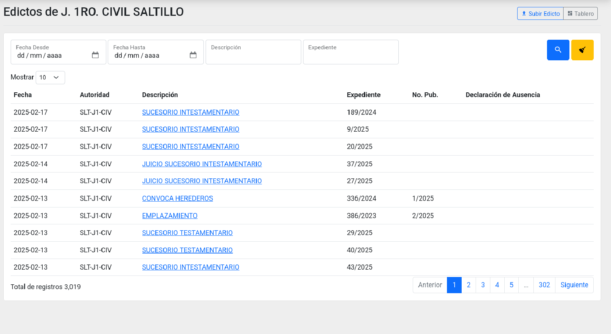
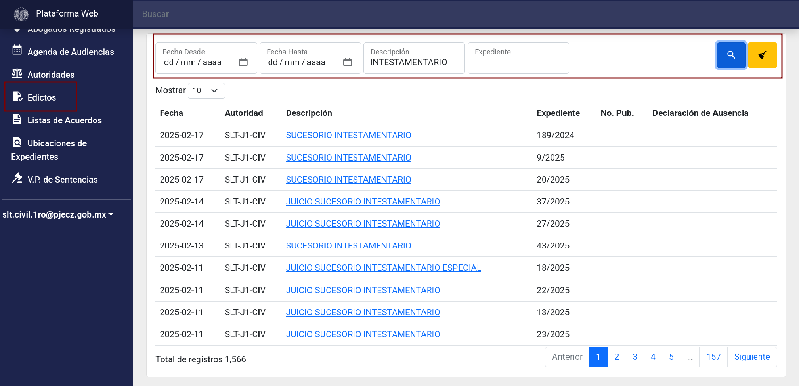
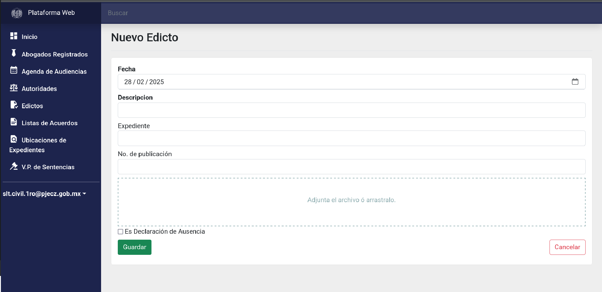
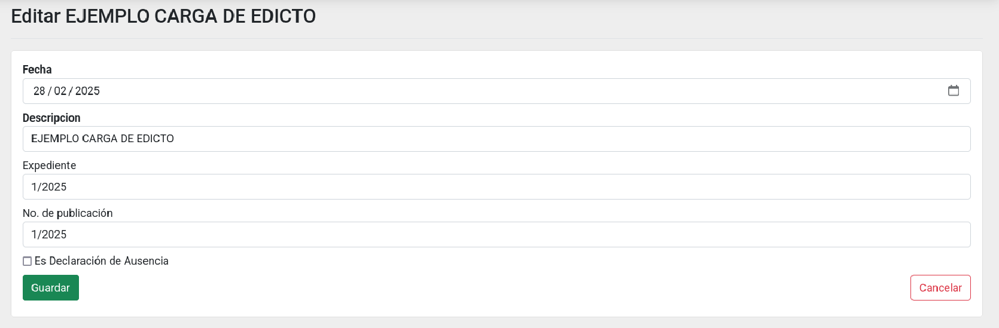
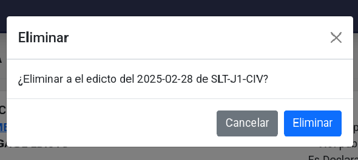
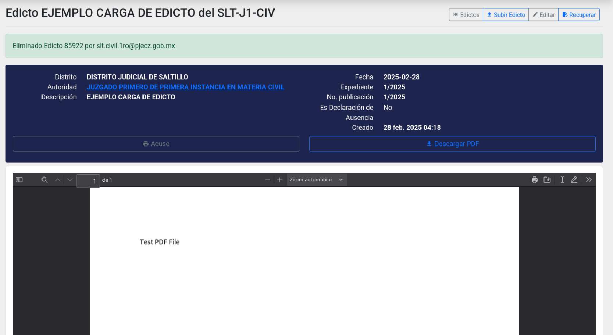
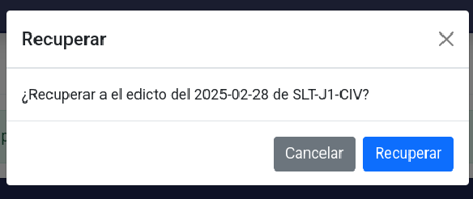

# Edictos

Los edictos son comunicaciones oficiales públicas cuyo objetivo es promulgar una disposición, hacer pública una resolución, dar noticia de la celebración de un acto o citar a una persona. En el sistema, el módulo de Edictos permite a los juzgados de diferentes materias gestionar la publicación y consulta de estos documentos de manera eficiente y organizada.

## Buscar y consultar

Ingrese a la Plataforma Web con la cuenta institucional del juzgado o tribunal, es decir, con la cuenta pjecz.gob.mx asignada a la autoridad, no una cuenta personal.
La página de inicio se muestra así:

Haga clic en el módulo **Edictos**. Se mostrará un listado con los edictos en orden cronológico inverso.

Utilice los botones **Anterior**, **No. de página** y **Siguiente** para navegar entre las páginas del listado. Si necesita visualizar más filas, seleccione otra cantidad en la opción **Mostrar** 

También puede usar el buscador, escriba en uno o más campos cómo lo quiere filtrar y
presione el botón **Lupa** o **ENTER** en su teclado. En cambio,
el botón **Escoba** limpia los campos del buscador y deja el listado sin filtros.

Ubique el **Edicto** que desea consultar y haga clic sobre él para acceder a su detalle.
En la vista detallada, encontrará los datos en el primer bloque y, en el segundo, la vista previa del archivo PDF (es necesario que el navegador tenga esta capacidad).

Haga clic en el botón **Acuse** para generar un comprobante de publicación, el cual puede imprimir o guardar como archivo PDF.

Use el botón **Descargar** para bajar una copia del archivo PDF del **Edicto**.

## Subir un edicto

Haga clic en el botón **Subir Edicto**. Se mostrará el formulario para subir.

Complete los campos requeridos. Los que aparecen en **negritas** son obligatorios:

- **Fecha**
- **Descripción**
- Expediente
- No. de publicación.
- **Adjuntar el archivo:** Sólo archivos PDF.
- Es Declaración de Ausencia.

Revise toda la información antes de guardar, ya que, una vez guardado, el edicto será público de manera inmediata.

Cuando termine, haga clic en el botón **Guardar**. Se mostrará el detalle del edicto publicado.

## Editar

Podrá editar un edicto hasta siete días después de haberlo publicado. Transcurrido este plazo, no será posible realizar modificaciones.

Para editar [busque y acceda al detalle](#buscar-consultar) de lo que quiera modificar.

Haga clic en el botón **Editar**. Mostrará el formulario de edición:

Realice los cambios necesarios y haga clic en **Guardar**.
Las modificaciones se reflejarán de inmediato en la consulta pública.

## Eliminar

Podrá eliminar un edicto hasta siete días después de haberlo publicado. Transcurrido este plazo, no será posible eliminarlo.

Para eliminar [busque y entre al detalle](#buscar-consultar) de lo que quiera modificar.

Haga clic en el botón **Eliminar**. Mostrará una pequeña ventana para confirmar:

Verifique que desea eliminar el edicto y haga clic en **Eliminar**.
Una vez eliminado, el detalle se mostrará con fondo oscuro.

## Recuperar

Si ha eliminado un edicto por error, podrá recuperarlo dentro de los siete días posteriores a su publicación. Transcurrido este plazo, no será posible restaurarlo.

Para recuperar un edicto eliminado, haga clic en el botón **Recuperar**. Se mostrará una ventana de confirmación:

Verifique que desea recuperar el edicto y haga clic en **Recuperar**.
Una vez restaurado, el detalle se mostrará con fondo claro.