# Plataforma Web - Exhortos

## Buscar y consultar exhortos

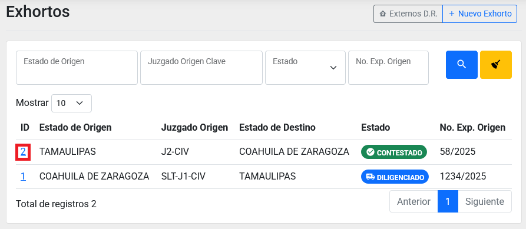

Puede utilizar los campos de búsqueda que se encuentran arriba del listado para buscar algún exhorto.

Además puede ingresar al detalla dando clic sobre el ID de un registros dentro de listado mostrado.

## Crear un nuevo exhorto

Dentro del módulo de Exhortos presione el **botón de Nuevo Exhorto**.

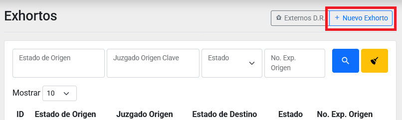

Esto lo llevará a un formulario donde deberá capturar los datos básicos de un exhorto

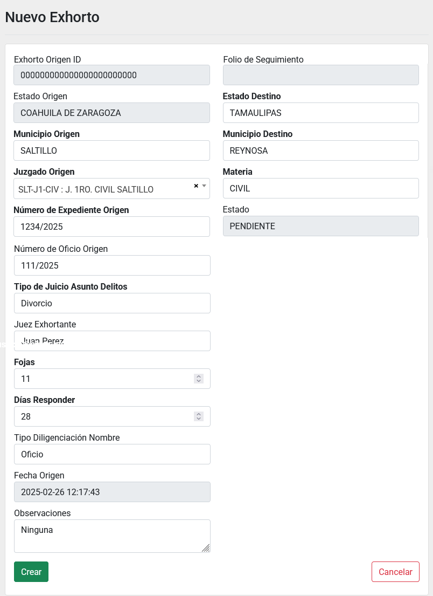

Una vez que haya terminado de llenar los campos obligatorios presione el **botón de crear**. Con esto se creará un exhorto es estado de PENDIENTE, que es un estado de edición.

Ahora debe añadir alguna parte y un archivo adjunto.

## Agregar partes al exhorto

Vaya al detalle de un exhorto que se encuentre en estado PENDIENTE.

Diríjase al apartado de Partes y presione el **botón Agregar** para ir al formulario de captura de partes.

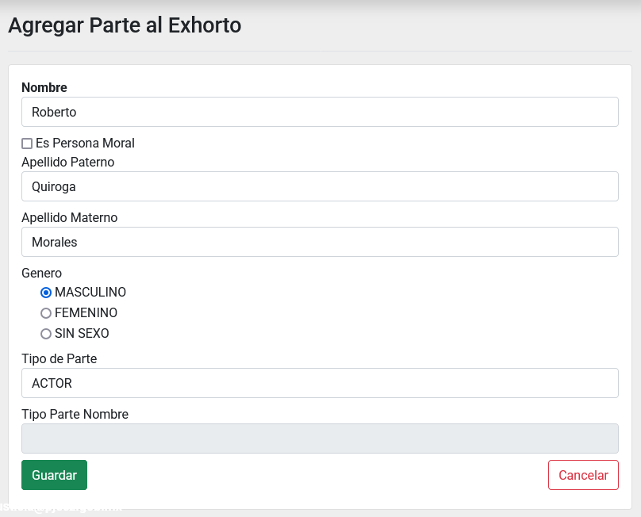

Puede elegir entre una persona moral o física. Activando la casilla de **Es Persona Moral**.

Además puede especificar el **Tipo de Parte** si selecciona la opción de *No Definido*.

## Subir archivos al exhorto

Dentro del detalle de un exhorto vaya al apartado de *Archivos* y presione el  **botón Agregar**.

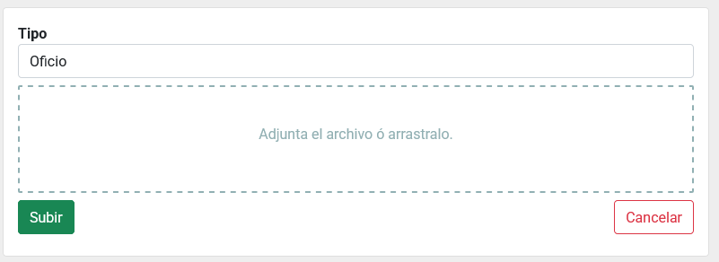

Tiene que seleccionar el *Tipo* y anexar un archivo adjunto. Después presione el **botón subir**.

## Enviar el exhorto

Si su exhorto ya contiene al menos una parte y un archivo anexo. Entre al detalle del exhorto y presione el **botón Enviar**.

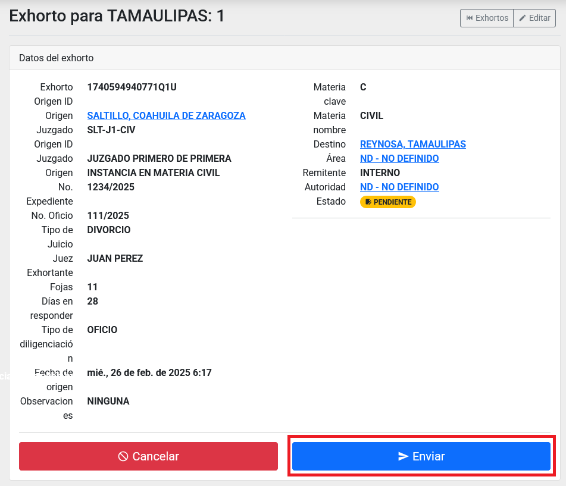

Aparecerá una ventana para confirmar su acción

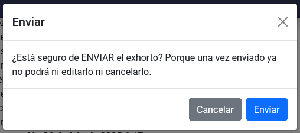

## Responder el exhorto

Primero debe adjuntar algún archivo de respuesta y/o un enlace de video.

Para agregar un archivo de respuesta, vaya al apartado de *Archivos de Respuesta* y presione el **botón Agregar Archivo de Respuesta**

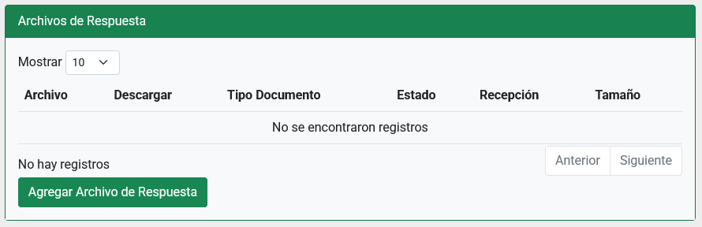

Ahora vera un formulario para adjuntar un archivo de respuesta, donde también debe indicar el tipo.

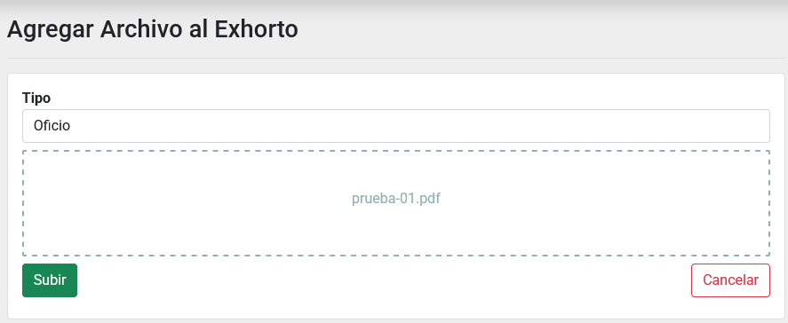

Para anexar un enlace de video, dentro del detalle del exhorto presione el **botón Agregar Enlace de Video**

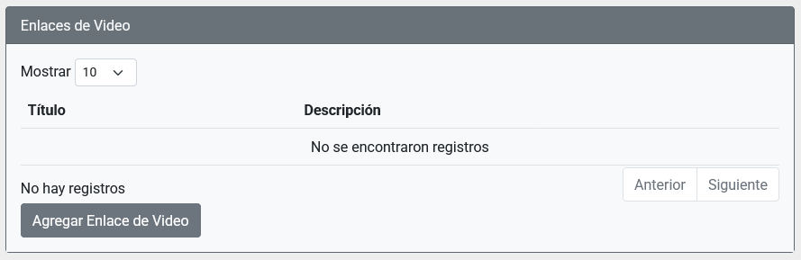

Abrirá un formulario para capturar los datos necesarios.

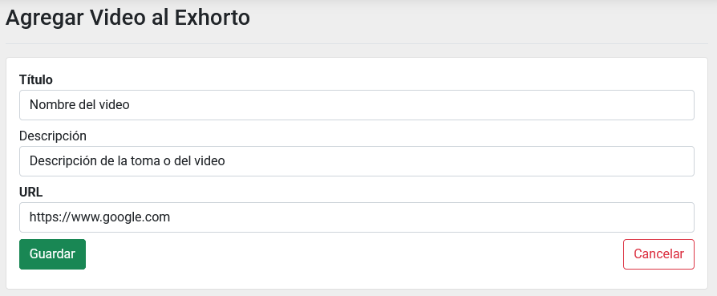

Ahora podrá contestar el exhorto, presionando el **botón Diligenciar**

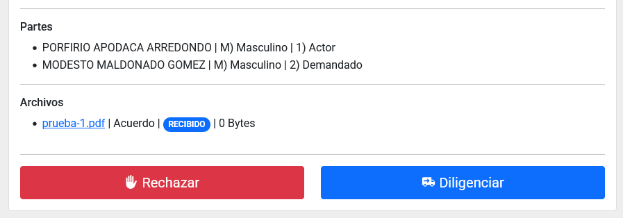

Después aparecerá y deberá presionar el **botón Contestar** para mandar los archivos de respuesta del exhorto al estado origen.

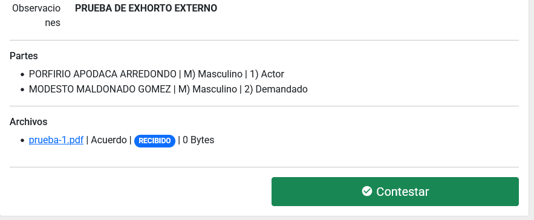

## Enviar actualizaciones de un exhorto

Dentro del detalle de un Exhorto vaya al apartado de *Actualizaciones* y presione el **botón Agregar Actualización**

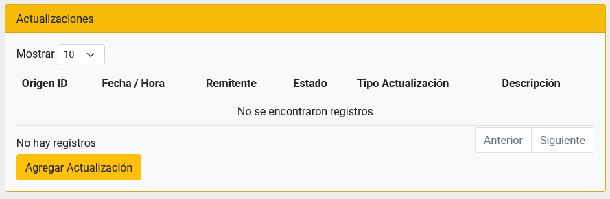

Abrirá un formulario para la captura de la actualización. Llene los campos y presione el **botón Guardar**

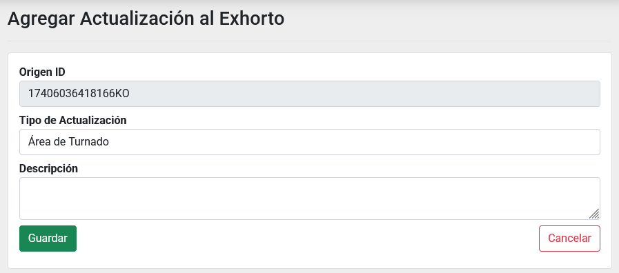

Puede esperar y editar los datos de la actualización.

Entrando al detalle de la actualización y si el estado de la misma es PENDIENTE, aparecerá el **botón Enviar**

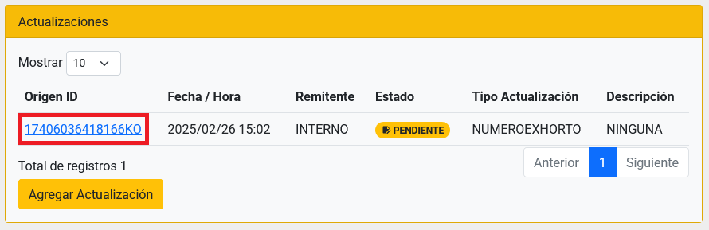

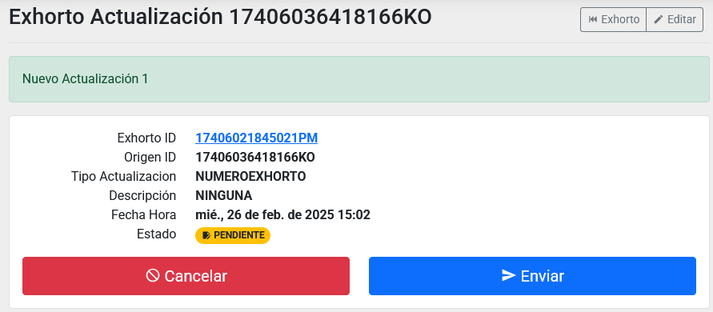

## Enviar promociones de un exhorto

Dentro del detalle de un Exhorto vaya al apartado de *Promociones* y presione el **botón Agregar Promoción**

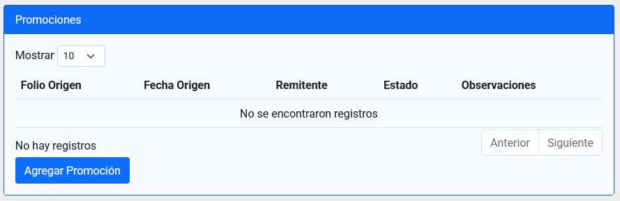

Capture la información en el formulario para crear una promoción que quedará en estado PENDIENTE

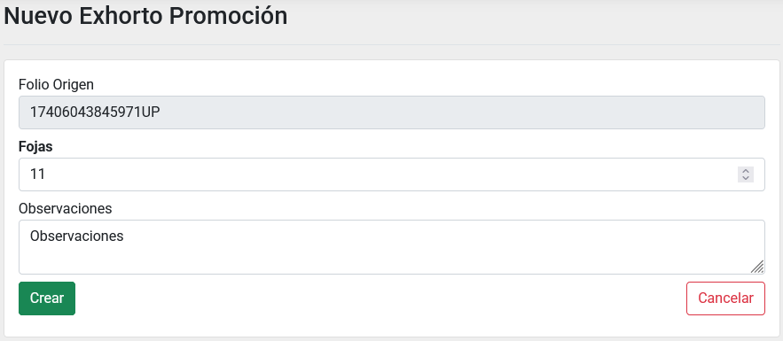

Ahora debe agregar promoventes y archivos adjuntos antes de poder presionar el **botón Enviar**

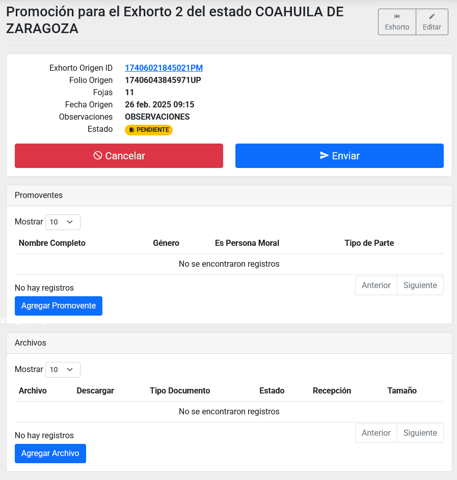
