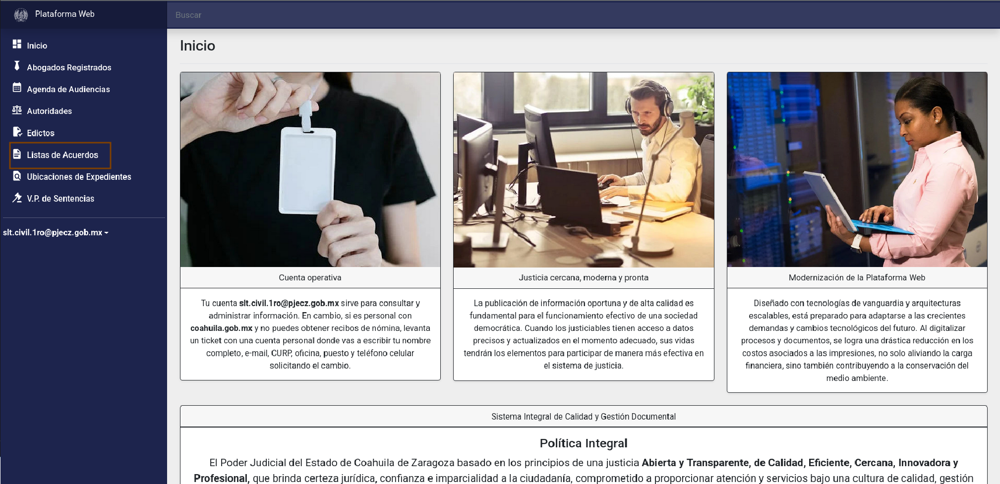
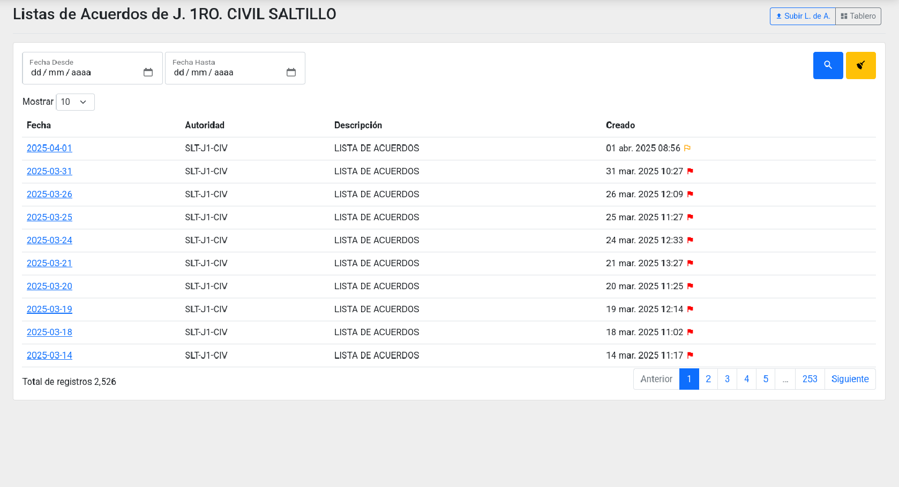
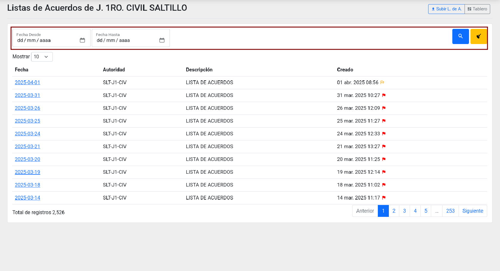
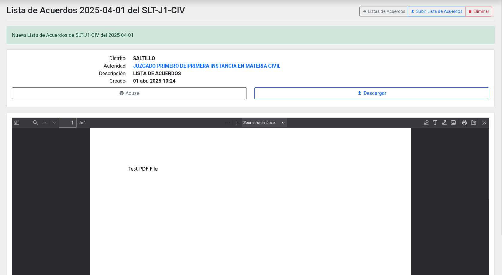
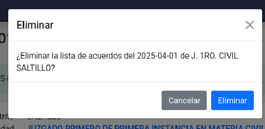
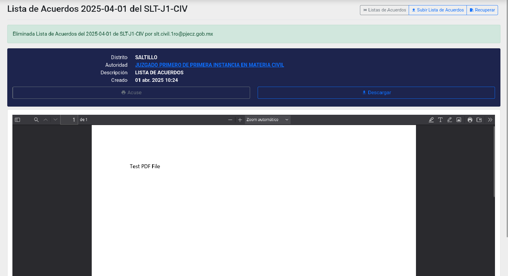
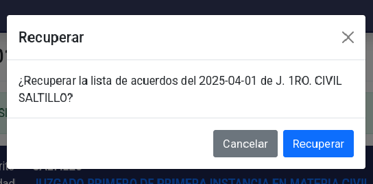
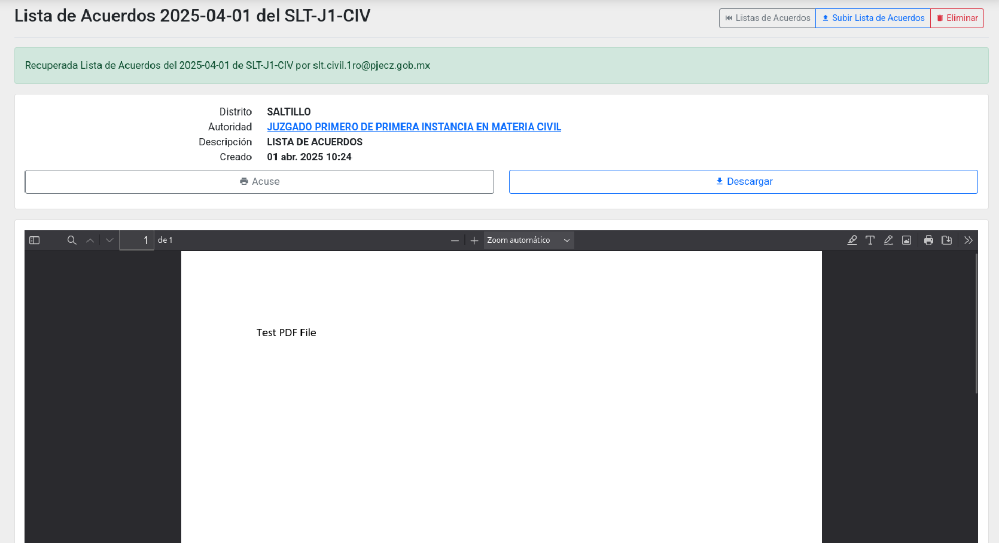

# Listas de Acuerdos

## Buscar y consultar
Ingrese a la Plataforma Web con la cuenta institucional del juzgado o tribunal, es decir, con la cuenta @pjecz.gob.mx asignada a la autoridad, no una cuenta personal.

La página de inicio se muestra así:

Haga clic en el módulo **Listas de Acuerdos**. Se mostrará un listado de listas de acuerdos en orden cronológico inverso.

Utilice los botones **Anterior**, **No. de página** y **Siguiente** para navegar entre las páginas del listado. Si necesita visualizar más filas, seleccione otra cantidad en la opción **Mostrar** 

También puede usar el buscador, escriba en uno o más campos cómo lo quiere filtrar y
presione el botón **Lupa** o **ENTER** en su teclado. El botón **Escoba** limpia los campos del buscador y restablece el listado sin filtros.

Ubique la **Lista de Acuerdos** que desea consultar y haga clic en la fecha correspondiente para acceder a su detalle.

En la vista detallada, encontrará los datos en el primer bloque y, en el segundo, la vista previa del archivo PDF (es necesario que el navegador tenga esta capacidad).

Haga clic en el botón **Acuse** para generar un comprobante de publicación, el cual podrá imprimir o guardar como archivo PDF.

Use el botón **Descargar** para obtener una copia del archivo PDF de la **Lista de Acuerdos**.

## Subir una lista de acuerdos

Haga clic en el botón **Subir L. de A.**. Se mostrará el formulario para subir una nueva lissta.

Complete los campos requeridos. Los que aparecen en **negritas** son obligatorios:

- **Adjuntar el archivo:** Sólo archivos PDF.

Revise que la información precargada sea correcta antes de guardar, ya que una vez guardada, la lista de acuerdos será pública de manera inmediata.

Cuando termine, haga clic en el botón **Guardar**. Se mostrará el detalle de la lista de acuerdos publicada.

## Eliminar

Podrá eliminar una lista de acuerdo hasta 24 horas después de haberla publicado. Transcurrido este plazo, no será posible eliminarla.

Para eliminar una lista, primero búsquela y acceda a su detalle.

Haga clic en el botón **Eliminar**. Se mostrará una pequeña ventana de confirmación:

Verifique que desea eliminar la lista de acuerdos y haga clic en **Eliminar**.

Una vez eliminada, el detalle se mostrará con fondo oscuro.

## Recuperar

Si ha eliminado una lista de acuerdo por error, podrá recuperarla dentro de las 24 horas posteriores a su publicación. Transcurrido este plazo, no será posible restaurarla.

Para recuperar una lista de acuerdo eliminada, haga clic en el botón **Recuperar**. Se mostrará una ventana de confirmación:

Verifique que desea recuperar la lista de acuerdo y haga clic en **Recuperar**.
Una vez restaurado, el detalle se mostrará con fondo claro.

