# Sistema Integral de Calidad y Gestión Documental (SICGD)

Como parte del compromiso por institucionalizar nuestro **Modelo de Justicia** estamos comprometidos a brindar un servicio de calidad y gestión documental. Para lograrlo, vamos a integrar nuestros procesos de servicios a los requisitos de las **Normas Internacionales ISO 9001:2005 e ISO 30301:2019.**

## Política de Calidad

El Poder Judicial del Estado de Coahuila de Zaragoza basado en los principios de una justicia **Abierta y Transparente, de Calidad, Eficiente, Cercana, Innovadora y Profesional,** que brinda certeza jurídica, confianza e imparcialidad a la ciudadanía, comprometido a proporcionar atención y servicios bajo una cultura de calidad, gestión documental y mejora contínua, con un enfoque centrado en la persona y sus derechos humanos.

## SICGD en Plataforma Web

A fin de fortalecer la integración y participación de todo el personal, hemos integrado a la **Plataforma Web** las capacidades para consultar y editar los procedimientos y formatos conforme a la Norma Internacional. Con sus virtudes, la plataforma cumple con los propósitos de reducir la cantidad de impresiones, la de salvaguardar nuestro conocimiento y brindar una difusión inmediata porque es el principal medio de consulta del **SICGD**.

## Consultar los procedimientos y formatos autorizados

Ingrese a Plataforma Web, de clic en **SICGD Procedimientos**, tendrá a la vista el listado de procedimientos.

Si su cuenta tiene el privilegio para consultar, entonces el listado es de los procedimientos **AUTORIZADOS**

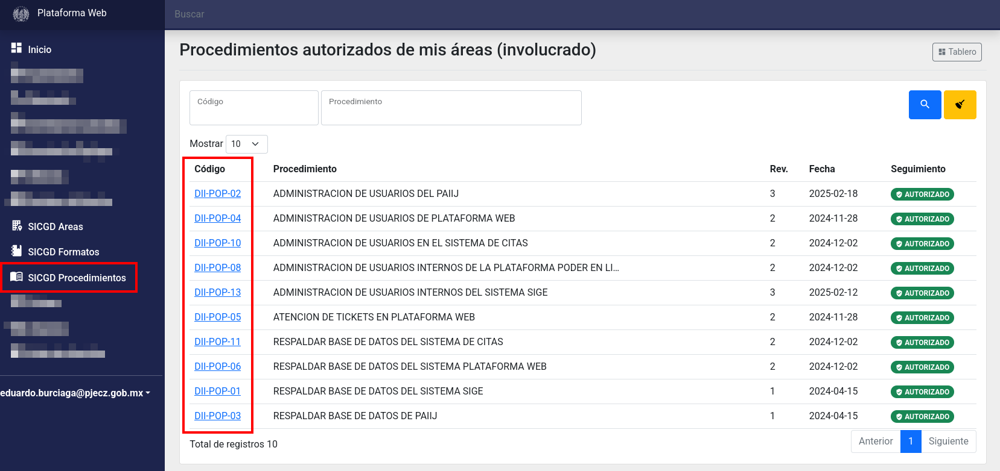

De clic en el **código** para ir al detalle.

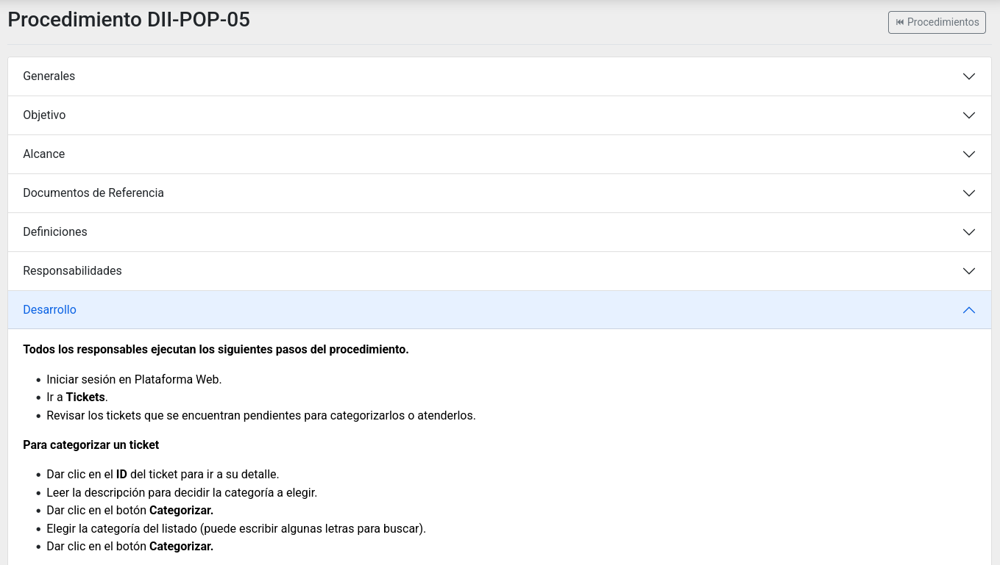

De clic en las cabeceras **Generales, Objetivo, Alcance...** etc. para mostrar y leer su contenido. Abajo está el listado de formatos.

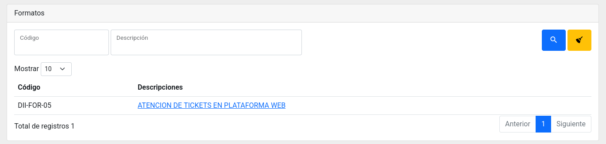

De clic en la **descripción** del formato para ir a su detalle.

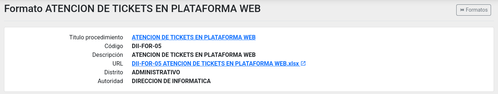

Para descargar el formato, de clic en su **URL.**

## Crear un nuevo procedimiento

De clic en el botón **Nuevo Procedimiento.**

Escriba el título, el código, el número de revisión y elija la fecha de elaboración.

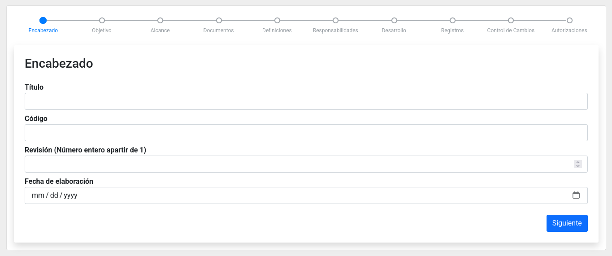

Luego de clic en **Siguiente**.

Escriba el objetivo. Debe ser el resultado y/o propósito esperado de las acciones descritas en el documento.

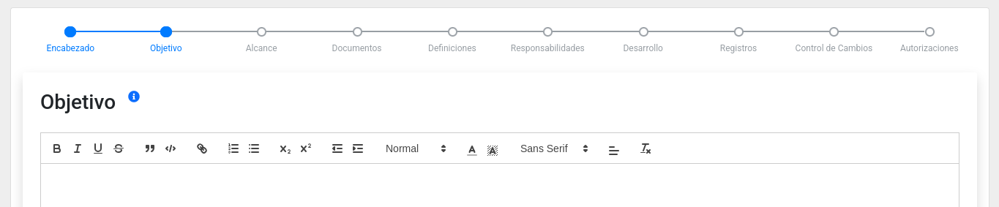

Luego de clic en **Siguiente**.

Escriba el alcance, el cual puede incluir la totalidad de la organización, procesos, subprocesos, funciones específicas e identificadas de la organización, secciones específicas e identificadas de la organización.

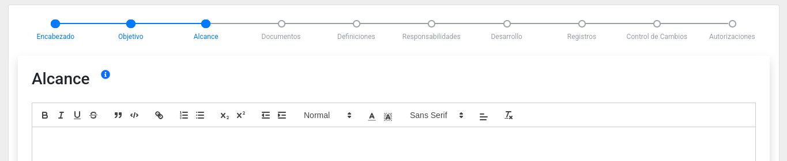

Luego de clic en **Siguiente**.

Liste los documentos de referencia. Son los documentos que tienen alguna relación con el contenido del documento y que deben tomarse en consideración al ejecutar las acciones descritas.

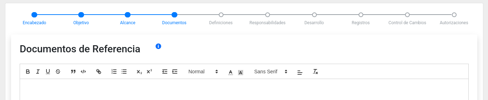

Luego de clic en **Siguiente**.

Liste las definiciones. Son las palabras o términos que son utilizados como parte del "lenguaje técnico" o interpretaciones apegadas a lo establecido a la norma de referencia.

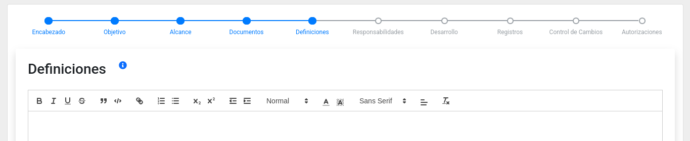

Luego de clic en **Siguiente**

Liste las responsabilidades. Son aquellas obligaciones que una persona debe responder. Se listan los puestos o las responsabilidades a cumplir conforme las acciones descritas en el documento.

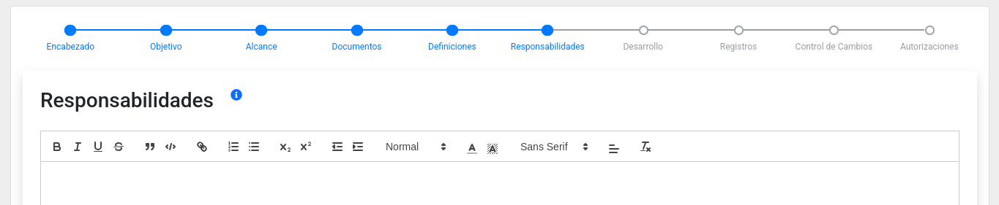

Luego de clic en **Siguiente**.

Escriba el desarrollo. Son los pasos secuenciales y lógicos que se siguen para lograr el resultado/propósito (objetivo) del documento. Se recomienda identificar en este apartado los riesgos, los formatos, las variables críticas, los indicadores de medición y los requisitos legales relacionados con las acciones descritas.

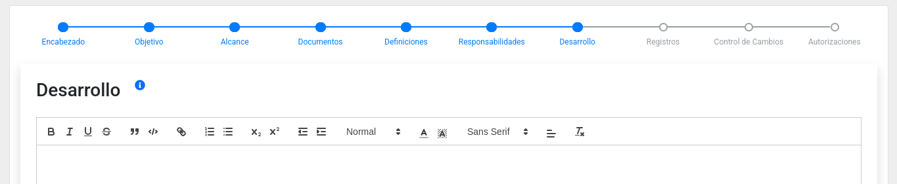

Luego de clic en **Siguiente**.

Alimente el primer registro. Son evidencias tangibles que demuestran que las acciones descritas en el documento se ejecutaron congruentemente con lo documentado.

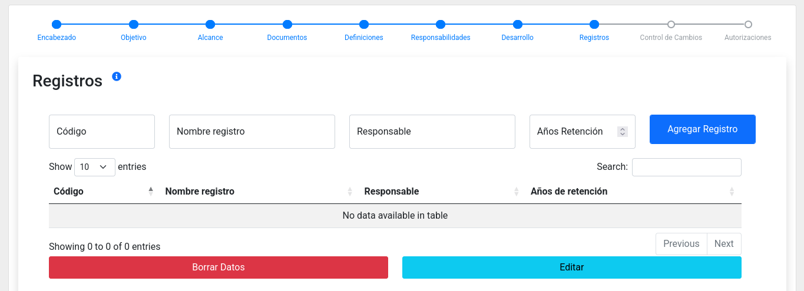

Luego de clic en **Siguiente**.

Alimente el control de cambios. Por último proporcione las identificaciones (códigos) de las modificaciones que ha sufrido el documento a lo largo de su período de implementación.

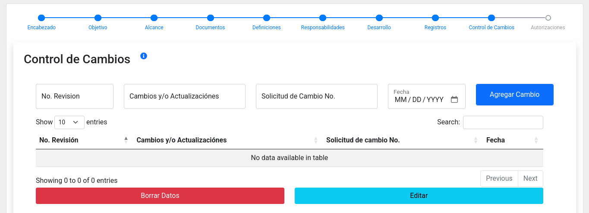

Luego de clic en **Siguiente**.

Defina quien elaboró, quien va a revisar y quien va a autorizar.

Luego de clic en **Guardar**.

Notará que el procedimiento tiene el seguimiento **EN ELABORACION**, lo que le permite hacer más cambios antes de firmarlo, dando clic en su **ID** en el listado y luego en el botón **Editar.**

Cuando esté listo para ser revisado o autorizado, de clic en el botón **Firmar**. Una vez firmado ya no podrá hacer cambios en su copia y quien vaya a revisar, y luego quien vaya a autorizar, recibirán un mensaje vía correo electrónico para que acepten o rechazen el proceso.

El revisor podrá leer, hacer cambios si quiere y firmar para pasárselo a quien va a autorizar.

Quien va autorizar también lo prodrá leer, modificar si así lo desea y al firmar tendrá el seguimiento **AUTORIZADO**. En este punto será público para todo el personal con privilegio de consulta y las revisiones anteriores pasarán a **ARCHIVADO**.

## Subir formatos

_PENDIENTE_

## Crear una nueva revisión a partir de un procedimiento autorizado

_PENDIENTE_
