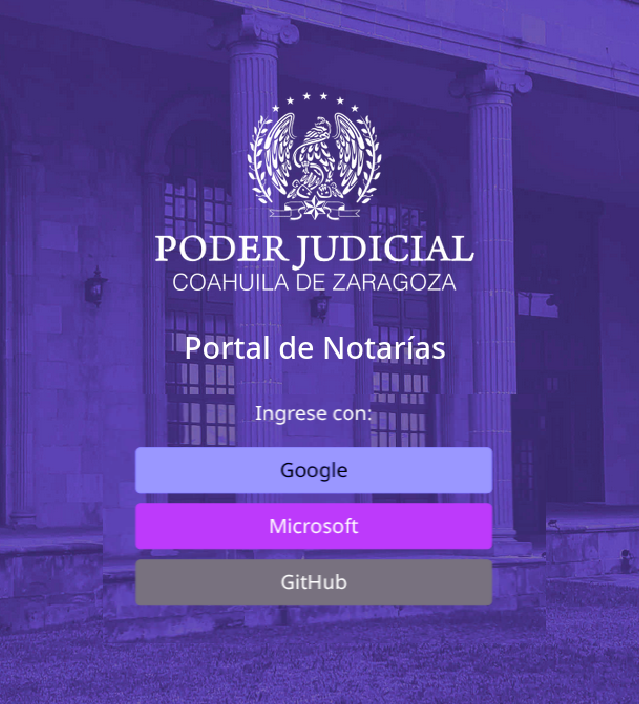

# Portal de Notarías

El Portal de Notarías es una plataforma que permite a las notarías publicar sus Edictos en el sitio web del Poder Judicial del Estado de Coahuila de Zaragoza.

Los edictos son comunicaciones oficiales públicas cuyo objetivo es promulgar una disposición, hacer pública una resolución, dar noticia de la celebración de un acto o citar a una persona. En el sistema, el módulo de Edictos permite a las notarías gestionar la publicación y consulta de estos documentos de manera eficiente y organizada.

## Módulos documentados

- [Edictos](/portal_notarias/edictos)

## Preguntas frecuentes

- **¿Cuál es la ventaja de usar el Portal de Notarías en lugar de enviar los edictos por correo electrónico?:**
    - Al subir el Edicto a la Plataforma éste se publica de inmediato en el sitio web. En cambio, vía correo electrónico, trabaja un programa que requiere varias horas para procesar los Edictos y publicarlos.
- **¿El Portal de Notarías sustituye el envío de Edictos por correo electrónico?:**
    - Si. No envíe vía correo electrónico los Edictos que suba a la plataforma, porque se verán duplicados.
- **¿Cómo ingreso al Portal de Notarías?:**
    - Para ingresar, debe utlizar la misma cuneta de correo electrónico con la que esten registrados y desde la cual envía sus publicaciones. 
    - En su navegador de internet, mantenga abierta la cuenta de correo electrónico con la que lo tenemos registrado. 
    - En la pantalla de inicio de sesión encontrara tres opciones:
        - Elija **Google** si su correo electrónico es de Gmail.
        - Elija **Microsoft** si su correo electrónico es de Hotmail, Outlook o Live.
        - Elija **GitHub** si tiene cuenta en esta plataforma.

        

    - Se abrirá una ventana emergente donde deberá ingresar su correo electrónico y contraseña, o bien confirmar si confía en esta plataforma.
    - Si el correo electrónico no está registrado, no podrá ingresar al portal.
    - Una vez validado el inicio de sesión, se mostrará un botón para acceder.
    - Le recomendamos cerrar la sesión y salir de la plataforma al finalizar su trabajar.
