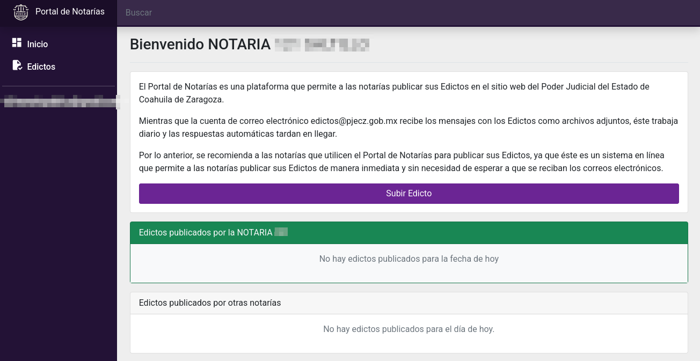
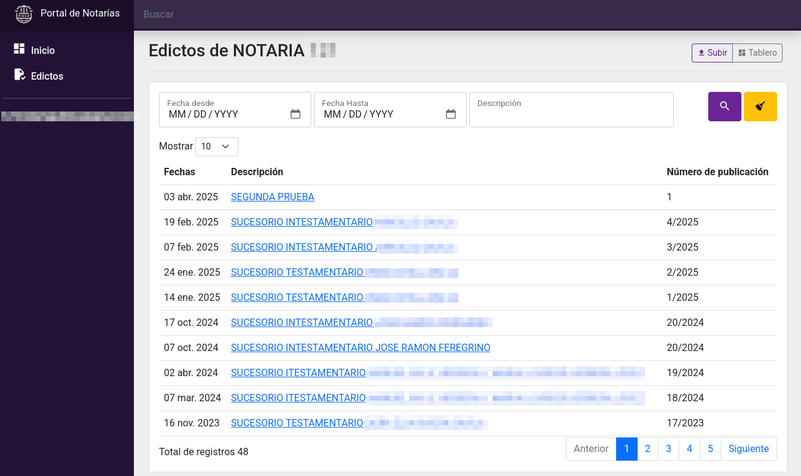
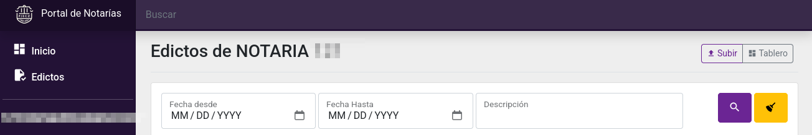
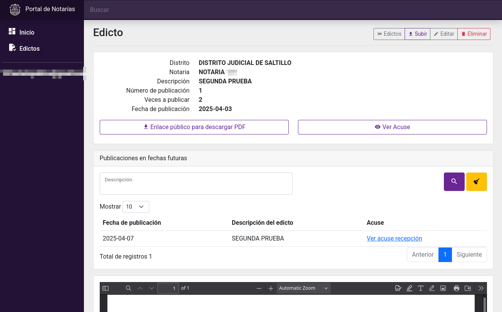
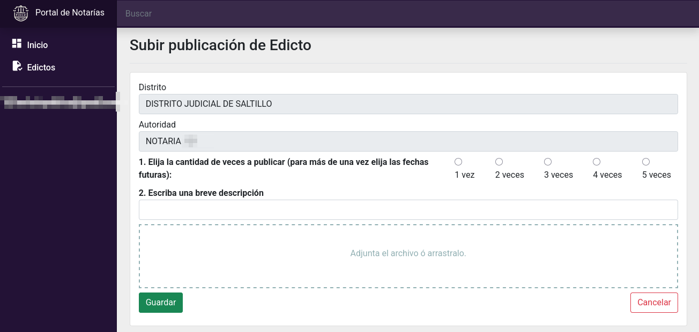
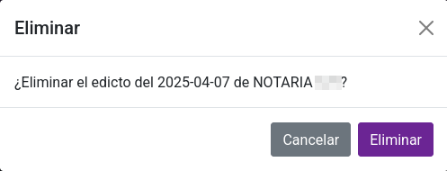
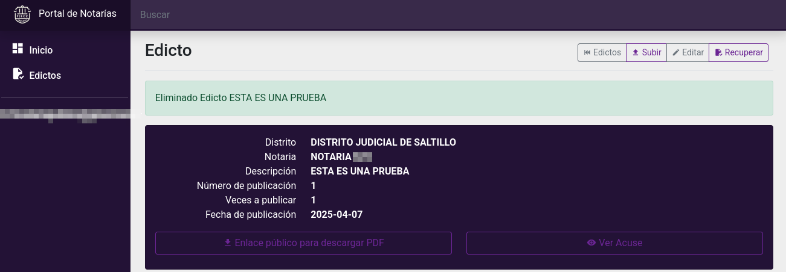
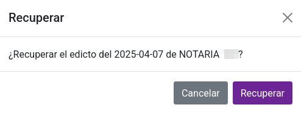
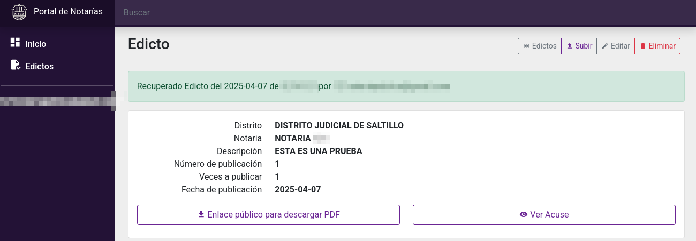

# Portal de Notarías - Edictos

Los edictos son comunicaciones oficiales públicas cuyo objetivo es promulgar una disposición, hacer pública una resolución, dar noticia de la celebración de un acto o citar a una persona.

## Buscar y consultar

Ingrese al Portal de Notarías con la cuenta de correo electrónico proporcionada. La página de inicio se muestra así:

Haga clic en el módulo **Edictos**. Se mostrará un listado con los edictos en orden cronológico inverso.

Utilice los botones **Anterior**, **No. de página** y **Siguiente** para navegar entre las páginas del listado. Si necesita visualizar más filas, seleccione otra cantidad en la opción **Mostrar**

También puede usar el buscador, escriba en uno o más campos cómo lo quiere filtrar y presione el botón **Lupa** o **ENTER** en su teclado. En cambio, el botón **Escoba** limpia los campos del buscador y deja el listado sin filtros.

Ubique el **Edicto** que desea consultar y haga clic sobre él para acceder a su detalle.
En la vista detallada, encontrará los datos en el primer bloque, en el segundo las publicaciones futuras, y en el tercer la vista previa del archivo PDF (es necesario que el navegador tenga esta capacidad).

Haga clic en el botón **Acuse** para generar un comprobante de publicación, el cual puede imprimir o guardar como archivo PDF.

Si desea abrir en otra pestaña la página pública del sitio web pjecz.gob.mx ese edicto, de clic en **Enlace público para descargar PDF**.

## Subir un edicto

Haga clic en el botón **Subir**. Se mostrará el formulario para subir.

Complete los campos requeridos. Los que aparecen en **negritas** son obligatorios:

1. **Elija la cantidad de veces a publicar** (para más de una vez elija las fechas futuras)
2. **Escriba una breve decripción**
3. **Adjuntar el archivo o arrastralo** (Sólo se permite el tipo de archivo PDF)

Revise toda la información antes de guardar, ya que una vez guardado, el edicto será público de manera inmediata.

Cuando termine, haga clic en el botón **Guardar**. Se mostrará el detalle del edicto publicado.

**Aproveche la comodidad de programar las fechas futuras de publicación. Así ya no tendrá que preocuparse por volver a ingresar al sistema para subirlo nuevamente en otra fecha.**

## Editar

Podrá editar un edicto dentro de las 24 horas siguientes a su publicación. Transcurrido este plazo, no será posible realizar modificaciones.

Para editar [busque y acceda al detalle](#buscar-consultar) de lo que quiera modificar.

Haga clic en el botón **Editar** y se mostrará el formulario de edición:

Realice los cambios necesarios y haga clic en **Guardar**.
Las modificaciones se reflejarán de inmediato en la consulta pública.

## Eliminar

Podrá eliminar un edicto dentro de las 24 horas siguientes a su publicación. Transcurrido este plazo, no será posible eliminarlo.

Para eliminar [busque y entre al detalle](#buscar-consultar) de lo que quiera modificar.

Haga clic en el botón **Eliminar**. Mostrará una pequeña ventana para confirmar:

Verifique que desea eliminar el edicto y haga clic en **Eliminar**.
Una vez eliminado, el detalle se mostrará con fondo oscuro.

## Recuperar

Si ha eliminado un edicto por error, podrá recuperarlo si inmediatamente da clic en **Recuperar**. Pero internamente, si han pasado más de 24 horas, ya no será posible restaurarlo.

Para recuperar un edicto eliminado, haga clic en el botón **Recuperar**. Se mostrará una ventana de confirmación:

Verifique que desea recuperar el edicto y haga clic en **Recuperar**.
Una vez restaurado, el detalle se mostrará con fondo claro.

