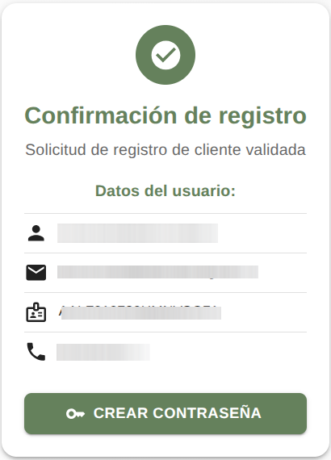

## Introducción

El Sistema de Citas te permite agendar, consultar o cancelar tus citas de manera rápida y sencilla, desde cualquier dispositivo con acceso a internet.

En esta nueva versión, al confirmar tu cita obtendrás un código QR, que deberás presentar el día de tu cita para ingresar a las instalaciones.

## Crear una cuenta nueva

Antes de poder agendar tu primera cita, necesitarás registrarte. Para crear tu cuenta, ten a la mano los siguientes datos:

- **Correo electrónico**
- **Nombre completo** (separado por: Nombres, Primer Apellido y Segundo Apellido)
- **CURP**
- **Número telefónico**

**Nota:** Si ya existe una cuenta con tu dirección de correo electrónico o con el CURP, no se puede crear otra cuenta con los mismos. En ese caso ve a la sección **Recuperar contraseña**.

### Pasos para registrarse

1. Entra al **Sistema de Citas.**
2. Haz clic en el botón **CREAR CUENTA**
3. Llena el formulario con tus datos y da clic al botón **CREAR CUENTA**
4. En algunos minutos, se enviará un mensaje vía correo electrónico para validar.
5. Revisa tu correo electrónico (si no aparece en la bandeja de entrada, revisar también en spam o correo no deseado.), abre el mensaje y da clic en el vínculo para confirmar tu registro.

### Validar cuenta

Después de registrarte, recibirás un mensaje para validar tu cuenta. Al dar clic en el enlace se mostrará el siguiente formulario.

A continuación, da clic en **CREAR CONTRASEÑA**

### Crear contraseña

Escribe una contraseña segura. Te recomendamos:

- Usar entre 8 y 24 caracteres.
- Combinar letras mayúsculas, minúsculas y números.
- No usar datos fáciles de adivinar, como tu nombre o fecha de nacimiento.

Da clic en **CREAR CONTRASEÑA**

## Inicio de sesión

1. Entra al **Sistema de Citas.**
2. Escribe tu dirección de correo electrónico y tu contraseña
3. Da clic en **INICIAR SESIÓN**

## Recuperar contraseña

Si olvidaste tu contraseña, haz los siguiente:

1. Haz clic en **¿Olvidaste tu contraseña?**.
2. Escribe tu correo electrónico registrado.
3. Revisa tu correo y sigue las instrucciones para crear una nueva contraseña.

## Crear una cita

1. Entra al **Sistema de Citas**
2. Dar clic en **NUEVA CITA**
3. De forma predetermina está fijo el Distrito Judicial. Elije la oficina correspondiente.
4. Elije el servicio que requeieres.
5. Escribe en Notas algo breve sobre el asunto o la palabra NINGUNA porque no puede quedar vacío.
6. Elije la fecha y
7. Elije la hora que tiene disponibilidad.
8. Dar clic en **AGENDAR CITA**

Tu cita quedará registrada y podrás ver el comprobante en la sección **MIS CITAS**, junto con tu código QR. Además recibirás un mensaje vía correo electrónico.

## Consular las citas agendadas

Da clic en **MIS CITAS**. Ahí encontrarás todas tus citas activas, con esta información.

- Fecha y hora
- Oficina
- Servicio
- Notas
- Código QR

## Cancelar una cita

Si por algún motivo no puedes asistir, te agredeceremos mucho que canceles la cita para que otra persona pueda ser atendida. El Sistema de Citas te permite cancelar tu cita hasta 24 horas antes de lo programado.

Pasos para cancelar una cita:

1. Ingresar a **MIS CITAS** (por defecto se muestran tus citas agendadas).
2. Seleccione la cita correspondiente.
3. Dar clic en el botón **CANCELAR**.
4. Confirmar la cancelación dando clic en el botón **CONFIRMAR**.

IMAGEN CANCELAR LA CITA

